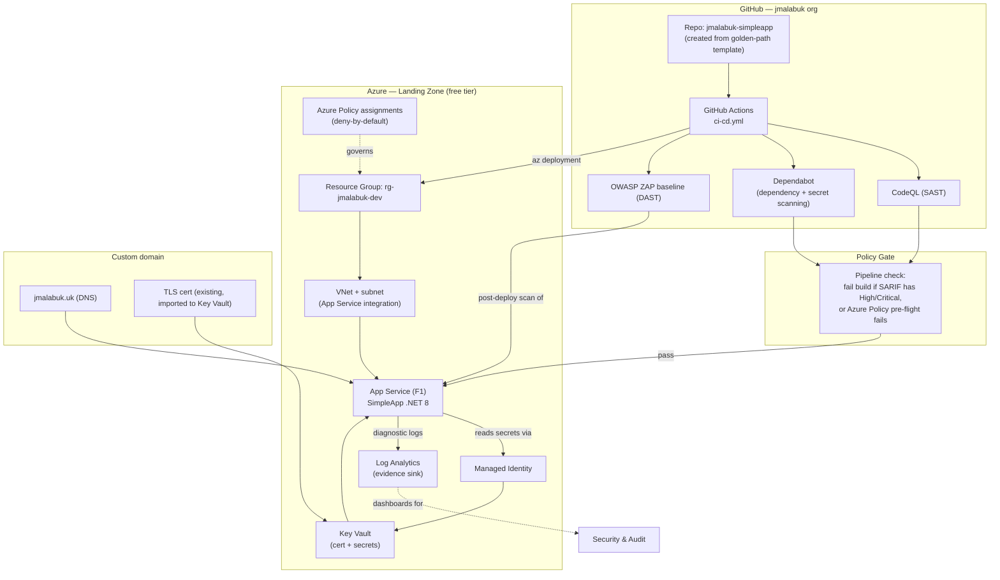

# Architecture

## System diagram

## The golden path, step by step

1. A product team creates a repo from the **template repo**, which already contains
   `.github/workflows/ci-cd.yml`, a Dependabot config, and a Bicep module reference — so secure
   defaults arrive with the repo, not as a follow-up task.
2. On push, the pipeline runs **build → CodeQL (SAST) → dependency & secret scan → Bicep
   what-if against Azure Policy**. Any High/Critical finding or policy violation **fails the
   build** — this is the "compliant by construction" gate, not a manual review step.
3. On merge to `main`, the pipeline deploys via `az deployment` using the **module in
   `infra/`** rather than hand-written ARM/Portal changes, so every deployment is auditable from
   git history.
4. Post-deploy, an **OWASP ZAP baseline scan (DAST)** runs against the live endpoint and results
   are attached to the pipeline run.
5. Diagnostic logs, the SARIF reports, and the policy compliance state all land in **Log
   Analytics** — this is the "evidence as a by-product" principle: an auditor queries the
   workspace instead of asking the team to produce a report.

## Identity & access

- The App Service uses a **system-assigned managed identity** to read secrets/certs from Key
  Vault — no credentials in app settings or pipeline secrets.
- The GitHub Actions workflow authenticates to Azure via **OIDC federated credentials**
  (`azure/login` with `client-id`/`tenant-id`, no stored client secret) — removes a long-lived
  secret from the biggest blast-radius location (CI/CD).
- RBAC is scoped at the resource group: pipeline identity gets `Contributor` on
  `rg-jmalabuk-dev` only, not subscription-wide.

## Network

- App Service is VNet-integrated into a `/27` subnet — deliberately small, since this is a single
  workload lab, but it demonstrates the pattern (private outbound, no public subnet exposure of
  data services) that scales to a real landing zone with private endpoints for Key Vault/Storage.
- On the free F1 tier, private endpoints for inbound traffic aren't available (that needs
  Premium), so the doc calls this out explicitly as the first upgrade if this became a real
  environment rather than a lab (see `docs/ROADMAP.md`).

## Why this maps to the role

- **Guardrails as code** → `policies/` + the Bicep policy module, not a wiki page.
- **Evidence as a by-product** → Log Analytics sink, SARIF artifacts, deployment history in git —
  nothing here is a manually maintained spreadsheet.
- **Platform-as-a-product** → the golden path is a *template repo*, i.e. the unit a product team
  actually consumes, not a set of instructions to follow.
